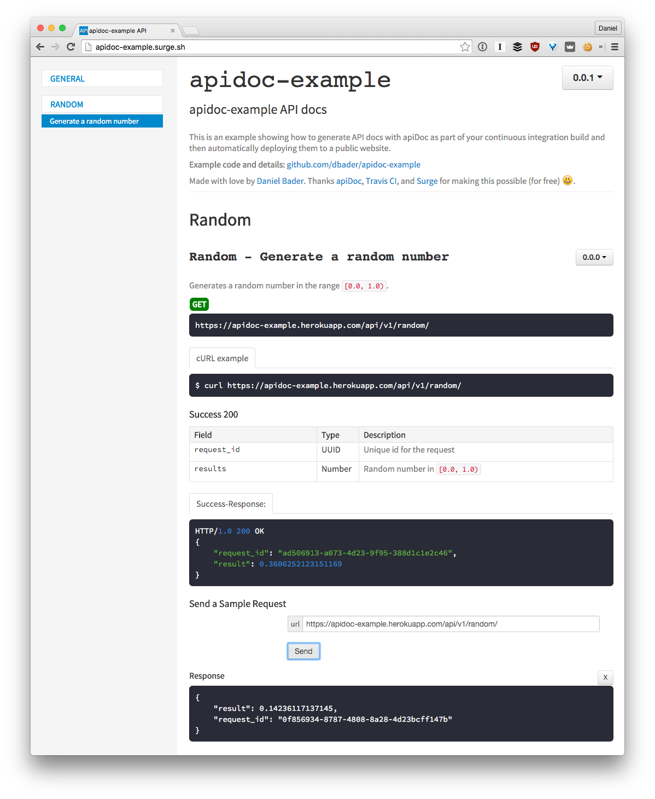

# apidoc-example

> This is an example showing how to generate API docs with apiDoc as part
of your continuous integration build and then automatically deploying
them to a public website.

[![Build Status][travis-image]][travis-url]

Thanks [apiDoc](http://apidocjs.com/), [Travis CI](https://travis-ci.org/), and [Surge](https://surge.sh) for making this possible (for free) :smiley:.



## How does this work?

* Pushing to master deploys a [Heroku app providing the API](https://apidoc-example.herokuapp.com/api/v1/random/)
* [Travis CI]([travis-url]) builds the project, generates API docs with apiDoc and publishes them to [apidoc-example.surge.sh](http://apidoc-example.surge.sh/)

## Running this locally

To build API docs:

```
$ npm install
$ npm run apidocs
```

To deploy API docs:

```
$ SURGE_LOGIN=... SURGE_TOKEN=... npm run apidocs-deploy
```

To run the demo web app:

```
$ pip install
$ gunicorn app.web:app
```

## Meta

Made with :heart: by Daniel Bader – [@dbader_org](https://twitter.com/dbader_org) – mail@dbader.org

Distributed under the Unlicense license. See ``LICENSE`` for more information.

[https://github.com/dbader/apidoc-example](https://github.com/dbader/)

[travis-image]: https://img.shields.io/travis/dbader/apidoc-example/master.svg?style=flat-square
[travis-url]: https://travis-ci.org/dbader/apidoc-example
